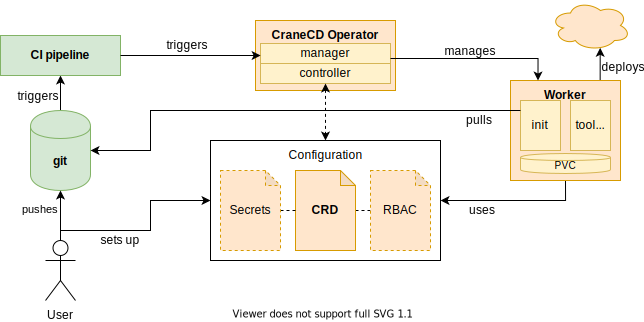

# CraneCD

CraneCD is a kubernetes operator to deploy applications to
kubernetes from within kubernetes. Key features include:

* _Pull-based_ deployment, but with immediate feedback to existing CI pipeline
* Fine-granular `ServiceAccount`-support for least privilege deployments
* Modular deployment job to support any tooling, e.g. `helm`, `kustomize`, ...

## Motivation

Most CI services do not have fine granular permissions to variables and no
audit logs for their interaction. However most git hosting services have
security controls for pull requests.
In security-sensitive environment it therefore made sense to reduce the amount
of secrets exposed as CI variables and rely on the repository as source of
truth. These deployment models are often referred to as pull-based deployments.

While some CD tools already implement pull-based deployments they lacked
features to reduce the required permissions and most are implemented as
standalone solution without integration into existing CI services.

Immediate feedback about a deployment and a failed pipeline if the deployment
stage failed is however essential for both developers and downstream CI stages,
e.g. integration tests.

## Concept

_CraneCD_ relies on git hosting solution to enforce its security controls, e.g.
four-eye principle via pull-request reviews.
The only exposed secret is a shared secret used to trigger a deployment.
It can only be used to invoke the process, but not to parameterize it.

A CRD (`CraneConfig`) is used to store a given configuration of a deployment
process. It contains the deployment and repository configuration including git
credentials, the aforementioned shared secret, a reference to the
`ServiceAccount` to use and more.

A user with permissions to create this CR sets up the deployment configuration
before-hand. Once this was setup properly the shared secret can be used to
trigger a deployment process.

The operator validates the shared secret and spawns a worker. All output is
streamed back to the invoker. The worker pulls the git repository changes using
the provided credentials and verifies branch and commit based on a configured
ruleset. If everything is valid, the repository is deployed using provided
configuration and specified tooling.

Any errors are propagated to the CLI, which triggered the process.

## Roadmap

There are several features on the roadmap:

*
